# CTLD — Cahier de Conception Détaillée

> **Langue** : Document rédigé en français. Une version anglaise sera produite en fin de projet.
> **Version** : 0.1 — branche `feature_modularisation_and_Config`
> **Date** : 2026-03-20

---

## Table des matières

1. [Objectif et périmètre](#1-objectif-et-périmètre)
2. [Architecture générale](#2-architecture-générale)
3. [Conventions et raccourcis](#3-conventions-et-raccourcis)
4. [Classes — détail](#4-classes--détail)
5. [Menus F10](#5-menus-f10)
6. [Système de build](#6-système-de-build)
7. [Évolutions prévues](#7-évolutions-prévues)

---

## 1. Objectif et périmètre

### 1.1 Contexte

CTLD (Combat Troop and Logistics Drop) est un script Lua pour DCS World gérant le transport tactique de troupes, caisses, véhicules, FOB et JTAC dans les missions multijoueurs. La base de code existante (∼12 000 lignes) est procédurale et monolithique.

### 1.2 Objectif

Migrer CTLD vers une architecture orientée objet (OOP) en Lua 5.1, dans les contraintes du DCS Scripting Engine (SSE) :

- **Isofonctionnel** : reproduire exactement toutes les fonctionnalités existantes
- **Modularité** : chaque domaine fonctionnel dans une classe dédiée
- **Maintenabilité** : CTLDCore < 500 lignes, chaque classe < 800 lignes
- **Nouvelles features** : Scenes/FOB via CTLDSceneManager, menu Unpack dynamique, renommage pack→pack
- **Build reproductible** : fusion des modules `src/` → `CTLD.lua`

### 1.3 Périmètre

| Domaine | Couvert | Classe cible |
|---|---|---|
| Transport de troupes | ✅ | CTLDTroopManager |
| Transport de caisses | ✅ | CTLDCrateManager |
| Transport de véhicules | ✅ | CTLDVehicleManager |
| FOB | ✅ | CTLDFOBManager + CTLDSceneManager |
| Systèmes AA multi-caisses | ✅ | CTLDAASystemManager + CTLDSceneManager |
| JTAC | ✅ | CTLDJtacManager |
| RECON | ✅ | CTLDRecon |
| Balises radio | ✅ | CTLDBeaconManager |
| Scènes DCS | ✅ | CTLDSceneManager (nouvelle) |
| Menus F10 | ✅ | Distribués dans chaque classe fonctionnelle |
| i18n | ✅ | CTLDi18n |
| Configuration | ✅ | CTLDConfig |

---

## 2. Architecture générale

### 2.1 Principes architecturaux

1. **Pattern Entité + Manager** : `CtldXxx` (entité, instanciée N fois) + `CTLDXxxManager` (singleton, registre + logique)
2. **Pattern Singleton** : tous les managers exposent `CTLDXxxManager.getInstance()`
3. **Pattern buildMenu()** : chaque classe fonctionnelle construit son propre bloc de menu F10 via `buildMenu(player)`
4. **Accès config** : uniquement via `ctld.gs("param")` (raccourci de `CTLDConfig:getSetting()`)
5. **Accès i18n** : uniquement via `ctld.tr("key", ...)` (raccourci de `CTLDi18n:translate()`)
6. **API DCS** : uniquement l'API officielle documentée sur https://wiki.hoggitworld.com/view/Simulator_Scripting_Engine_Documentation

### 2.2 Hiérarchie de dépendances

```
CTLDCore
  ├── CTLDConfig          (zéro dépendance)
  ├── CTLDi18n            (zéro dépendance)
  ├── CTLDUtils           (dépend de CTLDConfig)
  ├── MenuManager         (dépend de CTLDi18n)
  ├── CTLDObjectsDescDb   (zéro dépendance)
  ├── CTLDSceneManager    (dépend de CTLDObjectsDescDb, CTLDUtils)
  ├── CTLDZoneManager     (dépend de CTLDUtils, CTLDConfig)
  ├── CTLDTroopManager    (dépend de CTLDZoneManager, CTLDUtils, MenuManager)
  ├── CTLDCrateManager    (dépend de CTLDZoneManager, CTLDSceneManager, CTLDUtils, MenuManager)
  ├── CTLDVehicleManager  (dépend de CTLDZoneManager, CTLDUtils, MenuManager)
  ├── CTLDFOBManager      (dépend de CTLDSceneManager, CTLDBeaconManager, CTLDUtils)
  ├── CTLDAASystemManager (dépend de CTLDSceneManager, CTLDUtils, CTLDConfig)
  ├── CTLDBeaconManager   (dépend de CTLDUtils, CTLDConfig, MenuManager)
  ├── CTLDRecon           (dépend de CTLDUtils, CTLDConfig, MenuManager)
  ├── CTLDJtacManager     (dépend de CTLDUtils, CTLDConfig, MenuManager)
  └── CTLDPlayerManager   (dépend de tous les managers fonctionnels, MenuManager)
```

### 2.3 Diagramme de classes

```mermaid
classDiagram
    direction TB

    class CTLDCore {
        +getInstance() CTLDCore
        +init()
        +onPlayerEnterUnit(event)
        +onPlayerLeaveUnit(event)
        +startPolling()
    }
    class CTLDConfig {
        +getInstance() CTLDConfig
        +getSetting(key) any
    }
    class CTLDi18n {
        +getInstance() CTLDi18n
        +translate(key, ...) string
    }
    class CTLDUtils {
        +getHeadingInRadians(unit, flat) number
        +GetRelativeVec2Coords(origin, hdg, dist, ang) vec2
        +dynAddStatic(context, groupData) StaticObject
        +dynAddGroup(context, groupData) Group
        +getNextUniqId() number
        +drawQuad(coalitionId, points, name)
        +getUnitsInRadius(point, radius, coalition) table
        +getStaticsInRadius(point, radius) table
    }
    class MenuManager {
        +getInstance() MenuManager
        +getOrCreateRootMenu(groupId, label) Menu
        +removeGroupMenus(groupId)
        +addSubMenu(parent, label, groupId) Menu
        +addCommand(parent, label, groupId, cb, ...) Menu
    }
    class CTLDObjectsDescDb {
        +getInstance() CTLDObjectsDescDb
        +get(key) function
        +register(key, descFunc)
        +has(key) bool
    }
    class CtldZone {
        +name string
        +coalition number
        +point vec3
        +radius number
        +zoneType string
        +isInZone(point) bool
    }
    class CTLDZoneManager {
        +getInstance() CTLDZoneManager
        +loadZonesFromConfig()
        +getZonesForCoalition(coalition) CtldZone[]
        +getNearestZone(point, coalition, type) CtldZone
        +isUnitInZone(unitName) CtldZone
    }
    class CtldTroop {
        +groupName string
        +coalition number
        +size number
        +isLoaded bool
        +carrierUnit string
    }
    class CTLDTroopManager {
        +getInstance() CTLDTroopManager
        +getLoadableGroups(coalition, limit) CtldTroop[]
        +loadTroopsFromZone(unitName, groupName)
        +unloadExtractTroops(unitName)
        +checkTroopStatus(unitName)
        +buildMenu(player, parentMenu)
    }
    class CtldCrate {
        +id number
        +desc string
        +unit string
        +weight number
        +coalition number
        +position vec3
        +isLoaded bool
        +cratesRequired number
    }
    class CTLDCrateManager {
        +getInstance() CTLDCrateManager
        +spawnCrate(unitName, crateDesc, weight)
        +loadNearbyCrate(unitName)
        +dropSlingCrate(unitName)
        +unpackCrate(unitName, crateWeight)
        +getNearbyUnpackableCrates(unitName) CtldCrate[]
        +listNearbyCrates(unitName)
        +buildMenu(player, parentMenu)
        +buildUnpackSubMenu(player, parentMenu)
        +buildCommandsMenu(player, parentMenu)
    }
    class CtldVehicle {
        +groupName string
        +coalition number
        +typeName string
        +isLoaded bool
        +carrierUnit string
        +isPacked bool
    }
    class CTLDVehicleManager {
        +getInstance() CTLDVehicleManager
        +loadVehiclesFromZone(unitName)
        +unloadVehicles(unitName)
        +getPackableVehicles(unitName) CtldVehicle[]
        +packVehicleRequest(unitName, vehicleName)
        +loadUnloadFOBCrate(unitName)
        +buildMenu(player, parentMenu)
    }
    class CTLDFOBManager {
        +getInstance() CTLDFOBManager
        +tryUnpackFOBCrates(unitName)
        +spawnFOB(triggerUnit, point, name)
        +registerFOB(name, point, coalition)
        +listFOBs(unitName)
        +buildMenu(player, parentMenu)
    }
    class CtldScene {
        +name string
        +stepsDatas table
        +currentStep number
        +triggerUnit Unit
        +spawnedObjects table
        +execute(triggerUnit)
        +runNextStep()
    }
    class CTLDSceneManager {
        +getInstance() CTLDSceneManager
        +registerSceneModel(sceneModel)
        +getSceneModel(name) table
        +isSceneModel(name) bool
        +playScene(triggerUnit, sceneModel)
    }
    class CtldBeacon {
        +id number
        +coalition number
        +position vec3
        +frequency number
        +callsign string
        +unitName string
        +dcsBeaconId number
    }
    class CTLDBeaconManager {
        +getInstance() CTLDBeaconManager
        +dropRadioBeacon(unitName)
        +removeRadioBeacon(unitName)
        +listRadioBeacons(unitName)
        +createFOBBeacon(point, name, coalition)
        +buildMenu(player, parentMenu)
    }
    class CTLDRecon {
        +getInstance() CTLDRecon
        +showTargetsInLOS(unitName)
        +hideTargetsInLOS(unitName)
        +startAutoRefresh(unitName)
        +stopAutoRefresh(unitName)
        +buildMenu(coalitionId)
    }
    class CtldJtac {
        +groupName string
        +coalition number
        +currentTarget string
        +targetsList table
        +specialOptions table
    }
    class CTLDJtacManager {
        +getInstance() CTLDJtacManager
        +getJTACStatus(unitName)
        +setJTACTarget(groupName, target)
        +addJTACRadioCommand(groupName)
        +refreshMenus()
        +buildMenu(coalitionId)
    }
    class CtldPlayer {
        +unitName string
        +groupId number
        +coalition number
        +typeName string
        +isTransport bool
        +canCarryVehicles bool
        +loadedTroops table
        +loadedCrates table
        +loadedVehicles table
    }
    class CTLDPlayerManager {
        +getInstance() CTLDPlayerManager
        +onPlayerEnterUnit(unitName)
        +onPlayerLeaveUnit(unitName)
        +getPlayer(unitName) CtldPlayer
        +buildMenu(player)
        +refreshMenus()
    }
    class CTLDAASystemManager {
        +getInstance() CTLDAASystemManager
        +getSystemForCrate(crateUnit) table
        +tryAssemble(unitName, nearbyCrates)
        +tryRearm(unitName, nearestCrate, nearbyCrates, template)
        +tryRepair(unitName, nearestCrate, template)
        +countActiveSystems(coalition) number
        +getLimit(coalition) number
        +registerSystem(groupName, details)
        +unregisterSystem(groupName)
    }

    CTLDCore --> CTLDConfig
    CTLDCore --> CTLDi18n
    CTLDCore --> CTLDUtils
    CTLDCore --> CTLDPlayerManager
    CTLDCore --> CTLDJtacManager
    CTLDCore --> CTLDRecon
    CTLDPlayerManager --> CTLDTroopManager
    CTLDPlayerManager --> CTLDCrateManager
    CTLDPlayerManager --> CTLDVehicleManager
    CTLDPlayerManager --> CTLDFOBManager
    CTLDPlayerManager --> CTLDBeaconManager
    CTLDPlayerManager --> CtldPlayer
    CTLDFOBManager --> CTLDSceneManager
    CTLDFOBManager --> CTLDBeaconManager
    CTLDCrateManager --> CTLDSceneManager
    CTLDCrateManager --> CTLDAASystemManager
    CTLDCrateManager --> CtldCrate
    CTLDAASystemManager --> CTLDSceneManager
    CTLDVehicleManager --> CtldVehicle
    CTLDSceneManager --> CTLDObjectsDescDb
    CTLDSceneManager --> CtldScene
    CTLDZoneManager --> CtldZone
    CTLDTroopManager --> CtldTroop
    CTLDBeaconManager --> CtldBeacon
    CTLDJtacManager --> CtldJtac
```



---

## 3. Conventions et raccourcis

| Raccourci | Développé | Usage |
|---|---|---|
| `ctld.gs("param")` | `CTLDConfig.getInstance():getSetting("param")` | Lire un paramètre de config |
| `ctld.tr("key", ...)` | `CTLDi18n.getInstance():translate("key", ...)` | Traduire une clé i18n |

**Nommage** :
- Entités : `CtldXxx` (C majuscule, `tld` minuscule)
- Managers : `CTLDXxxManager` (tout en majuscules jusqu'au X)
- Méthodes : camelCase
- Constantes : UPPER_SNAKE_CASE
- Le terme **"pack" est banni** — utiliser "pack" partout (méthodes, config, menus, commentaires)

---

## 4. Classes — détail

### 4.1 CTLDConfig

**Responsabilité** : Singleton fournissant l'accès centralisé à tous les paramètres de configuration. Déjà implémenté en OOP dans `source/CTLD_config.lua` — copier dans `src/` sans modification.

**Fichier cible** : `src/CTLD_config.lua`
**Statut** : ✅ Existant — copie simple

**Méthodes publiques** :

| Signature | Description |
|---|---|
| `CTLDConfig.getInstance()` | Retourne l'instance singleton |
| `CTLDConfig:getSetting(key)` | Retourne la valeur du paramètre `key` |
| `ctld.gs(key)` | Raccourci global |

**Paramètres renommés (pack → pack)** :

| Ancien nom | Nouveau nom |
|---|---|
| `enablePackingVehicles` | `enablePackingVehicles` |
| `maximumDistancePackableUnitsSearch` | `maximumDistancePackableUnitsSearch` |

**Dépendances** : aucune

---

### 4.2 CTLDi18n

**Responsabilité** : Singleton gérant les traductions de toutes les chaînes affichées dans les menus et messages F10.

**Fichier cible** : `src/CTLD_i18n.lua`
**Statut** : 🔄 Migration depuis namespace procédural `ctld.i18n`

**Propriétés** :

| Propriété | Type | Description |
|---|---|---|
| `_translations` | `table[lang][key]` | Dictionnaire de traductions |
| `_currentLang` | `string` | Langue active (défaut : `"en"`) |

**Méthodes publiques** :

| Signature | Description |
|---|---|
| `CTLDi18n.getInstance()` | Retourne l'instance singleton |
| `CTLDi18n:setLang(lang)` | Change la langue active |
| `CTLDi18n:translate(key, ...)` | Retourne la traduction avec substitution `%1`, `%2`... |
| `ctld.tr(key, ...)` | Raccourci global |

**Dépendances** : aucune

---

### 4.3 CTLDUtils

**Responsabilité** : Module statique regroupant les fonctions utilitaires géométriques, de spawn, d'identifiants uniques et de dessin F10. Fonctions accessibles via `CTLDUtils.xxx()`.

**Fichier cible** : `src/CTLD_utils.lua`
**Statut** : 🔄 Migration depuis namespace procédural `ctld.utils`

**Méthodes publiques** :

| Signature | Description |
|---|---|
| `CTLDUtils.getHeadingInRadians(unit, flat)` | Cap de l'unité en radians |
| `CTLDUtils.GetRelativeVec2Coords(origin, headingRad, distance, angleOffsetDeg)` | Point relatif en coordonnées polaires |
| `CTLDUtils.dynAddStatic(context, groupData)` | Spawn d'un objet statique via `coalition.addStaticObject()` |
| `CTLDUtils.dynAddGroup(context, groupData)` | Spawn d'un groupe terrestre via `coalition.addGroup()` |
| `CTLDUtils.getNextUniqId()` | Retourne un identifiant unique incrémental |
| `CTLDUtils.drawQuad(coalitionId, vec3Points, name)` | Dessine un quadrilatère sur la carte F10 |
| `CTLDUtils.getDistance(point1, point2)` | Distance euclidienne entre deux vec3 |
| `CTLDUtils.getUnitsInRadius(point, radius, coalition)` | Liste des unités dans un rayon |
| `CTLDUtils.getStaticsInRadius(point, radius)` | Liste des objets statiques dans un rayon |

> `mist.dynAddStatic()` (présent dans `mineFieldSceneDatas.lua`) est remplacé par `CTLDUtils.dynAddStatic()`.

**Dépendances** : CTLDConfig (pour certains seuils)

---

### 4.4 MenuManager / Menu

**Responsabilité** : Gestion des menus F10 DCS. `Menu` représente un nœud de menu. `MenuManager` est le singleton gérant le cycle de vie des menus par groupe.

**Fichier cible** : `src/CTLD_menu.lua`
**Statut** : ✅ Existant — copie simple depuis `source/CTLD_menu.lua`

**Méthodes MenuManager** :

| Signature | Description |
|---|---|
| `MenuManager.getInstance()` | Singleton |
| `MenuManager:getOrCreateRootMenu(groupId, label)` | Retourne ou crée le sous-menu racine CTLD pour le groupe |
| `MenuManager:removeGroupMenus(groupId)` | Supprime tous les menus F10 du groupe |
| `MenuManager:addSubMenu(parent, label, groupId)` | Ajoute un sous-menu |
| `MenuManager:addCommand(parent, label, groupId, callback, ...)` | Ajoute une commande |

**Dépendances** : CTLDi18n

---

### 4.5 CTLDObjectsDescDb

**Responsabilité** : Registre singleton des descripteurs d'objets DCS utilisés par CTLDSceneManager. Chaque descripteur est une fonction retournant un `groupData` complet pour `coalition.addStaticObject()` ou `coalition.addGroup()`.

**Fichier cible** : `src/CTLD_objectsDescDb.lua`
**Statut** : 🔄 Migration + enrichissement depuis `source_scene_ini/dcsObjectsDescDb.lua`

**Entrées actuelles (15)** : `FARP`, `SINGLE_HELIPAD`, `Farp_FG_Petit_Helipad`, `FARP_Tent`, `FARP_Ammo_Storage`, `Fuel_Truck`, `repare_Truck`, `FARP_Security_Guard`, `barrels_cargo`, `ammo_cargo`, `Cargo06`, `NF-2_LightOn`, `Windsock`, `Tower Crane`, `us carrier shooter`

**Entrées à ajouter pour FOB** :

| Clé | `type` DCS | `category` | Notes |
|---|---|---|---|
| `"FOB_Outpost"` | `"outpost"` | `"Fortifications"` | Corps principal du FOB |
| `"FOB_Watchtower"` | `"house2arm"` | `"Fortifications"` | `rate=100`, tour de garde |

**Méthodes publiques** :

| Signature | Description |
|---|---|
| `CTLDObjectsDescDb.getInstance()` | Singleton |
| `CTLDObjectsDescDb:get(key)` | Retourne la fonction descripteur pour la clé |
| `CTLDObjectsDescDb:register(key, descFunc)` | Enregistre un nouveau descripteur (extensibilité mission maker) |
| `CTLDObjectsDescDb:has(key)` | Retourne true si la clé existe |

**Dépendances** : aucune

---

### 4.6 CtldZone / CTLDZoneManager

**Responsabilité** : `CtldZone` représente une zone DCS (pickup, dropoff, waypoint, extract, logistic). `CTLDZoneManager` charge les zones AI depuis la config à l'init et découvre les zones humain par parsing des noms DCS.

> **Décision EVO-09** : les pickupZones gèrent **uniquement les troupes**. Le chargement de véhicules depuis une pickupZone est supprimé (voir EVO-09 en section 7).
> **Feature S** : les zones AI (AIZ) sont déclarées par config (`cfg.settings["aiZones"]`), sans convention de nommage DCS. Voir §4.4 du missionmaker guide.

**Fichier cible** : `src/CTLD_zone.lua`
**Statut** : ✅ Implémenté

---

#### Zones AI (AIZ) — Feature S

Les zones AI sont déclarées dans `cfg.settings["aiZones"]` (table d'entrées) et chargées par `_loadAIZonesFromConfig()` à l'init du `CTLDZoneManager`.

**Champs d'une entrée AIZ** :

| Champ | Type | Obligatoire | Description |
|---|---|---|---|
| `dcsZoneName` | `string` | ✅ | Nom exact de la trigger zone DCS |
| `coalition` | `string` | ✅ | `"BLUE"` ou `"RED"` |
| `isPickup` | `bool` | au moins un | Zone de pickup |
| `isDropoff` | `bool` | au moins un | Zone de dropoff |
| `cargoType` | `string` | pickup | `"T"` (troupes), `"V"` (véhicule entier), `"TV"` (les deux). Défaut : `"T"` |
| `troopStock` | `number` | pickup T/TV | Nombre de soldats disponibles (-1 = illimité) |
| `aiDropMode` | `string` | dropoff | `"G"` (gotoAttackNearest), `"P"` (parachute), `"GP"` (les deux). Défaut : `"GP"` |
| `troopTemplates` | `table` | optionnel | Whitelist de noms de templates de troupes |
| `vehicleTypes` | `table` | optionnel | Whitelist de types DCS de véhicules éligibles |

---

#### Validation au démarrage (`_validateZoneNames()`)

Appelée à l'init du `CTLDZoneManager`, produit un rapport via `trigger.action.outText`, `env.warning` et `ctld.utils.log`. Messages i18n (EN/FR/ES/KO).

| Code | Type | Condition |
|---|---|---|
| G1 | ERROR | `dcsZoneName` manquant |
| G2 | ERROR | `dcsZoneName` dupliqué — entrée ignorée |
| G3 | ERROR | `coalition` manquante |
| G4 | ERROR | `coalition` invalide (ni `"BLUE"` ni `"RED"`) |
| G5 | ERROR | ni `isPickup` ni `isDropoff` définis |
| Fix5 | WARN | `isPickup=true` sans `cargoType` valide — défaut `"T"` appliqué |
| Fix6 | WARN | `isDropoff=true` sans `aiDropMode` valide — défaut `"GP"` appliqué |
| Overlap | WARN | pickup et dropoff même coalition dans la même trigger zone — risque de boucle |

Si zéro erreur et zéro warning : `"CTLDZoneManager: zone config valid"` loggé en INFO uniquement.

---

#### Transport IA — onAILand / _checkAIStatus

`CTLDCoreManager:onAILand(event)` — handler `S_EVENT_LAND` pour les pilotes IA :

1. Identifie le pilote via `_aiPilotNames`
2. Trouve la zone AIZ la plus proche du point de pose
3. Si zone pickup → charge troupes et/ou véhicule entier disponibles
4. Si zone dropoff → déploie la cargaison selon `aiDropMode`
5. Si aucune zone AIZ à portée → log WARN, aucune action

`_checkAIStatus()` : timer polling (toutes les 2 s) pour les transports IA déjà au sol au démarrage de la mission (non détectés par `S_EVENT_LAND`).

---

#### Convention de nommage des zones humain (EVO-10)

Le séparateur de champs est `_`. **Aucun champ ne peut contenir `_`**.

| Préfixe | Type | Schéma de nommage |
|---|---|---|
| `PKZ` | pickupZone (troupes) | `PKZ_name_[R/B/N]` |
| `WPZ` | wpZone (waypoint) | `WPZ_name_[R/B/N]` |
| `EXZ` | extractZone | `EXZ_name` |
| `LGZ` | logisticZone | `LGZ_name_[R/B/N]` |

**Zones polygonales :** détectées par présence de `verticies` dans `env.mission.triggers.zones`.
- Circulaire → `isInZone(point)` : `distance(point, center) ≤ radius`
- Polygonale → `isInZone(point)` : ray casting sur `verticies`

---

**Propriétés CtldZone** :

| Propriété | Type | Description |
|---|---|---|
| `zoneName` | `string` | Paramètre `name` extrait du nom DCS |
| `dcsName` | `string` | Nom DCS complet de la trigger zone |
| `coalition` | `number` | Coalition (`side`) |
| `center` | `vec3` | Centre de la zone |
| `radius` | `number` | Rayon (zones circulaires) |
| `verticies` | `table\|nil` | Sommets (zones polygonales) |
| `zoneType` | `string` | `"pickup"` `"drop"` `"waypoint"` `"extract"` `"logistic"` `"ai_pickup"` `"ai_drop"` |
| `active` | `bool` | Zone active ou désactivée |
| `smoke` | `number` | Couleur fumée (-1 = aucune) |
| `limit` | `number` | Limite de groupes (PKZ uniquement, -1 = illimité) |
| `flagName` | `string\|nil` | Flag DCS auto (EXZ uniquement) = `NAME_FLG` |
| `cargoType` | `string\|nil` | Type cargaison AIZ pickup (`"T"`, `"V"`, `"TV"`) |
| `troopStock` | `number\|nil` | Stock de soldats AIZ pickup (-1 = illimité) |
| `aiDropMode` | `string\|nil` | Mode déploiement AIZ dropoff (`"G"`, `"P"`, `"GP"`) |

**Méthodes CtldZone** :

| Signature | Description |
|---|---|
| `CtldZone:new(data)` | Constructeur |
| `CtldZone:isInZone(point)` | Circulaire ou ray casting polygonal selon type |
| `CtldZone:getCenter()` | Retourne vec3 centre |
| `CtldZone:activate()` / `CtldZone:deactivate()` | Active/désactive |

**Méthodes CTLDZoneManager** :

| Signature | Description |
|---|---|
| `CTLDZoneManager.getInstance()` | Singleton |
| `CTLDZoneManager:_loadAIZonesFromConfig()` | Charge les AIZ depuis `cfg.settings["aiZones"]` (Feature S) |
| `CTLDZoneManager:_validateZoneNames()` | Rapport d'erreurs/warnings AIZ au démarrage (i18n) |
| `CTLDZoneManager:discoverZones()` | Scan `env.mission.triggers.zones` + parsing + instanciation |
| `CTLDZoneManager:getZonesForCoalition(coalition, type)` | Zones filtrées par coalition et type |
| `CTLDZoneManager:getZoneByName(name, type)` | Zone par `zoneName` et type |
| `CTLDZoneManager:getNearestZone(point, coalition, type)` | Zone la plus proche |
| `CTLDZoneManager:isUnitInZone(unitName, type)` | Retourne la zone où se trouve l'unité, ou nil |
| `CTLDZoneManager:updateZoneCounter(zoneName, diff)` | Incrémente/décrémente le compteur PKZ |

**Dépendances** : CTLDConfig, CTLDUtils

---

### 4.7 CtldTroop / CTLDTroopManager

**Responsabilité** : Gestion du transport de troupes. `CtldTroop` représente un groupe de troupes. `CTLDTroopManager` orchestre chargement, déchargement, extraction et construit le bloc de menu "Troop Transport".

**Fichier cible** : `src/CTLD_troop.lua`
**Statut** : 🆕 À créer (migration depuis `source/CTLD_core.lua`)

**Propriétés CtldTroop** :

| Propriété | Type | Description |
|---|---|---|
| `groupName` | `string` | Nom DCS du groupe |
| `coalition` | `number` | Coalition |
| `size` | `number` | Nombre de soldats |
| `isLoaded` | `bool` | En cours de transport |
| `carrierUnit` | `string\|nil` | Nom de l'unité porteuse |
| `lastZone` | `string\|nil` | Dernière zone connue |

**Méthodes CTLDTroopManager** :

| Signature | Description |
|---|---|
| `CTLDTroopManager.getInstance()` | Singleton |
| `CTLDTroopManager:getLoadableGroups(coalition, transportLimit)` | Groupes disponibles au chargement |
| `CTLDTroopManager:loadTroopsFromZone(unitName, groupName)` | Charge un groupe depuis la zone |
| `CTLDTroopManager:unloadExtractTroops(unitName)` | Décharge ou extrait les troupes |
| `CTLDTroopManager:checkTroopStatus(unitName)` | Affiche le statut du cargo de troupes |
| `CTLDTroopManager:buildMenu(player, parentMenu)` | Construit "Troop Transport" [PAG: 9/p] |

**Dépendances** : CTLDZoneManager, CTLDUtils, CTLDConfig, MenuManager

---

### 4.8 CtldCrate / CTLDCrateManager

**Responsabilité** : Gestion du cycle de vie des caisses logistiques (spawn, chargement sling, dépose, déballage). L'unpack applique une logique de dispatch par priorité : scène DCS, système AA, ou spawn classique.

**Fichier cible** : `src/CTLD_crate.lua`
**Statut** : 🆕 À créer (migration depuis `source/CTLD_core.lua`)

**Propriétés CtldCrate** :

| Propriété | Type | Description |
|---|---|---|
| `id` | `number` | Identifiant unique |
| `desc` | `string` | Description affichée dans le menu |
| `unit` | `string` | Type d'unité DCS ou clé de scène |
| `weight` | `number` | Poids (sert d'identifiant de type) |
| `coalition` | `number` | Coalition propriétaire |
| `position` | `vec3` | Position DCS de la caisse |
| `dcsObject` | `StaticObject` | Référence à l'objet DCS spawned |
| `isLoaded` | `bool` | Chargée sous un hélicoptère |
| `carrierUnit` | `string\|nil` | Unité porteuse |
| `category` | `string` | Catégorie de menu (ex: `"Vehicles"`, `"FOB"`) |
| `cratesRequired` | `number` | Nombre de caisses requis pour unpack |
| `side` | `number\|nil` | Restriction coalition (nil = toutes) |

**Méthodes CTLDCrateManager** :

| Signature | Description |
|---|---|
| `CTLDCrateManager.getInstance()` | Singleton |
| `CTLDCrateManager:spawnCrate(unitName, crateDesc, weight)` | Spawne une caisse devant l'hélico |
| `CTLDCrateManager:loadNearbyCrate(unitName)` | Charge la caisse la plus proche (sling load) |
| `CTLDCrateManager:dropSlingCrate(unitName)` | Dépose la caisse chargée |
| `CTLDCrateManager:unpackCrate(unitName, crateWeight)` | Dispatch : 1) scène DCS 2) système AA 3) spawn classique |
| `CTLDCrateManager:getNearbyUnpackableCrates(unitName)` | Liste des caisses déballables à proximité |
| `CTLDCrateManager:listNearbyCrates(unitName)` | Affiche la liste des caisses proches (message F10) |
| `CTLDCrateManager:buildMenu(player, parentMenu)` | Construit "Crates: Vehicle/FOB/Drone" [PAG: 10 catégories/p, 10 caisses/p] |
| `CTLDCrateManager:buildUnpackSubMenu(player, parentMenu)` | Construit "Unpack Any Crate" — sous-menu dynamique contextuel [PAG: 10/p] |
| `CTLDCrateManager:buildCommandsMenu(player, parentMenu)` | Construit "CTLD Commands" (Load/Drop/Unpack/List/FOBs) |

**Dépendances** : CTLDZoneManager, CTLDSceneManager, CTLDUtils, CTLDConfig, MenuManager

---

### 4.9 CtldVehicle / CTLDVehicleManager

**Responsabilité** : Gestion du transport de véhicules et de la fonctionnalité pack (empaquetage d'un véhicule en caisse transportable). Contrainte `unitCanCarryVehicles` obligatoire pour afficher le bloc de menu.

**Fichier cible** : `src/CTLD_vehicle.lua`
**Statut** : 🆕 À créer (migration depuis `source/CTLD_core.lua`)

**Propriétés CtldVehicle** :

| Propriété | Type | Description |
|---|---|---|
| `groupName` | `string` | Nom DCS du groupe véhicule |
| `coalition` | `number` | Coalition |
| `typeName` | `string` | Type DCS du véhicule |
| `isLoaded` | `bool` | Chargé dans un transport |
| `carrierUnit` | `string\|nil` | Unité porteuse |
| `isPacked` | `bool` | Converti en caisse transportable |

**Méthodes CTLDVehicleManager** :

| Signature | Description |
|---|---|
| `CTLDVehicleManager.getInstance()` | Singleton |
| `CTLDVehicleManager:loadVehiclesFromZone(unitName)` | Charge des véhicules depuis une zone |
| `CTLDVehicleManager:unloadVehicles(unitName)` | Décharge les véhicules |
| `CTLDVehicleManager:getPackableVehicles(unitName)` | Véhicules packables dans le rayon `maximumDistancePackableUnitsSearch` |
| `CTLDVehicleManager:packVehicleRequest(unitName, vehicleName)` | Empaquète un véhicule en caisse |
| `CTLDVehicleManager:loadUnloadFOBCrate(unitName)` | Charge/dépose une caisse FOB |
| `CTLDVehicleManager:buildMenu(player, parentMenu)` | Construit "Vehicle/FOB Transport" + sous-menu "Pack Vehicles" [PAG: 10/p] |

> Config renommée : `enablePackingVehicles` (ex-`enablePackingVehicles`), `maximumDistancePackableUnitsSearch` (ex-`maximumDistancePackableUnitsSearch`).

**Dépendances** : CTLDZoneManager, CTLDUtils, CTLDConfig, MenuManager

---

### 4.10 CTLDFOBManager

**Responsabilité** : Singleton gérant le cycle de vie des FOBs. La construction physique est déléguée à `CTLDSceneManager` via la scène `"FOB"`. Gère la détection des caisses FOB, le déclenchement du déploiement et l'enregistrement dans les unités logistiques.

**Fichier cible** : `src/CTLD_fob.lua`
**Statut** : 🆕 À créer (migration + refactoring depuis `source/CTLD_core.lua`)

**Modèle de scène FOB** (défini dans `src/scenes/CTLD_fobSceneDatas.lua`) :

| Étape | Clé objectsDescDb | Offset polaire | Notes |
|---|---|---|---|
| 1 | `"FOB_Outpost"` | distance=0, angle=0 | Corps principal (`type="outpost"`) |
| 2 | `"FOB_Watchtower"` | distance≈38.4 m, angle≈69° | Tour de garde (`type="house2arm"`, rate=100) |

> Offsets calculés depuis les valeurs hardcodées actuelles : `x+14.857, z-36.571`.

**Mécanique de déclenchement** :
```
totalCrates = bigFOBCrates + (smallFOBCrates / 3.0)
condition   = totalCrates >= ctld.gs("cratesRequiredForFOB")
périmètre   = 750 m
```

**Méthodes CTLDFOBManager** :

| Signature | Description |
|---|---|
| `CTLDFOBManager.getInstance()` | Singleton |
| `CTLDFOBManager:tryUnpackFOBCrates(unitName)` | Détecte caisses FOB dans 750 m, vérifie condition, déclenche la scène |
| `CTLDFOBManager:spawnFOB(triggerUnit, point, name)` | Délègue à `CTLDSceneManager:playScene(triggerUnit, fobSceneModel)` |
| `CTLDFOBManager:registerFOB(name, point, coalition)` | Enregistre dans `logisticUnits` + crée balise radio FOB |
| `CTLDFOBManager:listFOBs(unitName)` | Affiche la liste des FOBs actifs |
| `CTLDFOBManager:buildMenu(player, parentMenu)` | Ajoute "List FOBs" dans "CTLD Commands" [COND: enabledFOBBuilding] |

**Dépendances** : CTLDSceneManager, CTLDBeaconManager, CTLDUtils, CTLDConfig

---

### 4.11 CtldScene / CTLDSceneManager

**Responsabilité** : `CTLDSceneManager` est le registre des modèles de scènes. `CtldScene` représente une instance en cours d'exécution (un déploiement). Chaque scène est entièrement définie dans son propre fichier sous `src/scenes/`.

**Fichiers** : `src/CTLD_sceneManager.lua` + `src/scenes/CTLD_xxxScene.lua` (un par scène)

---

#### Workflow — Créer une nouvelle scène

Chaque scène est un fichier unique `src/scenes/CTLD_xxxScene.lua` contenant **4 blocs obligatoires** :

##### BLOC 1 — i18n (4 langues : en/fr/es/ko)

```lua
ctld.i18n["en"]["XXX Crate"]            = "XXX Crate"
ctld.i18n["fr"]["XXX Crate"]            = "Caisse XXX"
ctld.i18n["es"]["XXX Crate"]            = "Caja XXX"
ctld.i18n["ko"]["XXX Crate"]            = "XXX 화물"
ctld.i18n["en"]["Deploy XXX"]           = "Deploy XXX"
-- ... (fr/es/ko idem)
ctld.i18n["en"]["--- XXX deployed by %1 ---"] = "--- XXX deployed by %1 ---"
-- ... (fr/es/ko idem)
```

##### BLOC 2 — Entrées CTLDObjectRegistry

```lua
CTLDObjectRegistry.registerIfAbsent("My_Object", { groupType="STATIC", ... })
-- registerIfAbsent est un no-op si la clé existe déjà → partage sûr entre scènes
```

##### BLOC 3 — Modèle de scène + descripteur crate

```lua
local xxxScene = {}
xxxScene.name = "XXX"   -- clé stable : utilisée partout, ne jamais hardcoder ailleurs

xxxScene.crate = {
    weight         = 1001.XX,   -- prochain slot libre dans la plage 1001.xx
    i18nKey        = "XXX Crate",
    deployKey      = "Deploy XXX",
    groundKey      = "...",     -- optionnel : message si joueur en vol
    cratesRequired = N,
    side           = nil,       -- nil=Both | "blue" | "red"
    showSets       = false,
    -- fobCompatible = true,    -- UNIQUEMENT pour scènes de type FOB (CTLDFOBManager)
    -- unpack = function(unit, unitName, sceneName) ... end,  -- UNIQUEMENT si logique custom
}

xxxScene.steps = {
    -- Chaque step : objets spawned séquentiellement avec délai
    { polar = { distance=0, angle=0 }, delayAfterPreviousStep=0,
      relativeHeadingInDegrees=0, relativeAltitudeInMeters=0,
      registryKey = "My_Object",
      func = function(ctx) ... return true end },  -- func optionnel post-spawn
    ...
}
```

**Structure d'un step** :

| Champ | Type | Description |
|---|---|---|
| `registryKey` | `string\|nil` | Clé dans CTLDObjectRegistry. Nil = step func-only |
| `polar` | `{distance, angle}` | Position relative au trigger unit (mètres, degrés) |
| `relativeHeadingInDegrees` | `number` | Cap de l'objet relatif au heading du trigger unit |
| `relativeAltitudeInMeters` | `number` | Décalage vertical |
| `delayAfterPreviousStep` | `number` | Délai en secondes après le step précédent |
| `func` | `function(ctx)\|nil` | Callback post-spawn. `ctx` : `{unit, spawnedObj, scene, step}`. Retourne `true` pour valider |

**Contexte `ctx` disponible dans `func`** :

| Champ | Description |
|---|---|
| `ctx.unit` | DCS Unit déclencheur |
| `ctx.spawnedObj` | Objet DCS spawné par ce step (nil si func-only) |
| `ctx.scene` | Instance CtldScene courante (`_params`, `_spawnedObjs`, `_refX`/`_refZ`/`_refHdgRad`) |
| `ctx.step` | Table du step courant |

##### BLOC 4 — Self-registration (toujours en dernier)

```lua
CTLDSceneManager.getInstance():registerSceneModel(xxxScene)
```

##### Checklist post-création

1. Ajouter `scenes/CTLD_xxxScene.lua` dans `tools/merger_V2/listToMerge.txt` **avant** `CTLD_core.lua`
2. Rebuild : `powershell -ExecutionPolicy Bypass -File "tools\merger_V2\merge_CTLD.ps1"`
3. Aucune modification dans : `CTLD_config.lua`, `CTLD_i18n_*.lua`, `CTLD_sceneManager.lua`, `CTLD_crate.lua`

---

#### Scènes de type FOB

Les scènes qui délèguent à `CTLDFOBManager` déclarent `fobCompatible = true` dans `model.crate` et une fonction `unpack` :

```lua
fobCompatible = true,
unpack = function(unit, unitName, sceneName)
    CTLDFOBManager.getInstance():unpackFOBCrates(unit, unitName, sceneName)
end,
```

`CTLDFOBManager._collectFOBCrates()` détecte automatiquement toute scène avec `fobCompatible = true` + filtre par `sceneName` → plusieurs types FOB coexistent sans conflit.

---

#### Méthodes CTLDSceneManager

| Signature | Description |
|---|---|
| `CTLDSceneManager.getInstance()` | Singleton |
| `:registerSceneModel(model)` | Enregistre par `model.name` |
| `:getModel(name)` | Retourne le modèle ou nil |
| `:getScene(name)` | Alias de getModel |
| `:playScene(unit, name, params, onComplete)` | Crée et démarre une instance CtldScene |

#### Auto-injection dans CTLDCrateManager

`CTLDCrateManager:_processSpawnableCrates()` itère `CTLDSceneManager._models` et injecte automatiquement chaque `model.crate` dans `_weightIndex` et `_processedCrates["Both"|"BLUE"|"RED"]`. Les scènes apparaissent ainsi dans le menu **Request Equipment** sans aucune entrée dans `CTLD_config.lua`.

**Collision de poids** : si le weight déclaré est déjà pris par une autre unité, le slot `1001.xx` suivant libre est utilisé automatiquement (WARN loggé).

**Dépendances** : CTLDObjectRegistry, CTLDUtils

---

### 4.12 CtldBeacon / CTLDBeaconManager

**Responsabilité** : Gestion des balises radio (TACAN/ADF) déposées par les joueurs ou créées automatiquement lors du spawn d'un FOB.

**Fichier cible** : `src/CTLD_beacon.lua`
**Statut** : 🔄 Migration depuis `source/CTLD_beacon.lua`

**Propriétés CtldBeacon** :

| Propriété | Type | Description |
|---|---|---|
| `id` | `number` | Identifiant unique |
| `coalition` | `number` | Coalition propriétaire |
| `position` | `vec3` | Position DCS |
| `frequency` | `number` | Fréquence en Hz |
| `modulation` | `number` | Modulation (AM/FM) |
| `callsign` | `string` | Identifiant radio |
| `unitName` | `string\|nil` | Unité ayant déposé la balise (nil si FOB) |
| `dcsBeaconId` | `number` | ID retourné par l'API DCS |

**Méthodes CTLDBeaconManager** :

| Signature | Description |
|---|---|
| `CTLDBeaconManager.getInstance()` | Singleton |
| `CTLDBeaconManager:dropRadioBeacon(unitName)` | Dépose une balise à la position de l'hélico |
| `CTLDBeaconManager:removeRadioBeacon(unitName)` | Supprime la balise la plus proche |
| `CTLDBeaconManager:listRadioBeacons(unitName)` | Affiche la liste des balises actives |
| `CTLDBeaconManager:createFOBBeacon(point, name, coalition)` | Crée une balise statique pour un FOB |
| `CTLDBeaconManager:buildMenu(player, parentMenu)` | Construit "Radio Beacons" (transport) ou "List Radio Beacons" (non-transport) |

**Dépendances** : CTLDUtils, CTLDConfig, MenuManager

---

### 4.13 CTLDRecon

**Responsabilité** : Singleton gérant la fonctionnalité RECON — affichage des cibles ennemies en ligne de visée (LOS) sur la carte F10, avec option auto-refresh.

**Fichier cible** : `src/CTLD_recon.lua`
**Statut** : 🔄 Migration depuis `source/CTLD_recon.lua`

**Méthodes publiques** :

| Signature | Description |
|---|---|
| `CTLDRecon.getInstance()` | Singleton |
| `CTLDRecon:showTargetsInLOS(unitName)` | Affiche les cibles en LOS sur la carte F10 |
| `CTLDRecon:hideTargetsInLOS(unitName)` | Masque les marqueurs de cibles |
| `CTLDRecon:startAutoRefresh(unitName)` | Active le rafraîchissement automatique |
| `CTLDRecon:stopAutoRefresh(unitName)` | Désactive le rafraîchissement automatique |
| `CTLDRecon:buildMenu(coalitionId)` | Construit le bloc RECON [COND: reconF10Menu == true] |

**Dépendances** : CTLDUtils, CTLDConfig, MenuManager

---

### 4.14 CtldJtac / CTLDJtacManager

**Responsabilité** : Gestion des JTAC — désignation laser de cibles, options spéciales, menu de sélection de cibles. Polling toutes les 10 secondes pour mise à jour des menus.

**Fichier cible** : `src/CTLD_jtac.lua`
**Statut** : 🔄 Migration depuis `source/CTLD_jtac.lua`

**Propriétés CtldJtac** :

| Propriété | Type | Description |
|---|---|---|
| `groupName` | `string` | Nom DCS du groupe JTAC |
| `coalition` | `number` | Coalition |
| `currentTarget` | `string\|nil` | Cible actuellement désignée |
| `targetsList` | `table` | Cibles disponibles groupées par typeName |
| `specialOptions` | `table` | Options spéciales avec `globalToggle` |
| `menuId` | `number\|nil` | ID du menu F10 créé pour ce JTAC |

**Méthodes CTLDJtacManager** :

| Signature | Description |
|---|---|
| `CTLDJtacManager.getInstance()` | Singleton |
| `CTLDJtacManager:getJTACStatus(unitName)` | Affiche le statut de tous les JTACs |
| `CTLDJtacManager:setJTACTarget(groupName, target)` | Définit la cible du JTAC |
| `CTLDJtacManager:addJTACRadioCommand(groupName)` | Crée le menu F10 pour un JTAC |
| `CTLDJtacManager:refreshMenus()` | Rafraîchit les menus JTAC (appelé par le polling 10s) |
| `CTLDJtacManager:buildMenu(coalitionId)` | Construit le bloc JTAC complet [PAG: 9 groupes/p] |

**Dépendances** : CTLDUtils, CTLDConfig, MenuManager

---

### 4.15 CtldPlayer / CTLDPlayerManager

**Responsabilité** : Orchestration principale côté joueur. `CtldPlayer` représente l'état d'un joueur en jeu. `CTLDPlayerManager` détecte les entrées/sorties d'unité, détermine les capacités de l'appareil et délègue la construction des menus.

**Fichier cible** : `src/CTLD_player.lua`
**Statut** : 🆕 À créer (extraction depuis `source/CTLD_core.lua`)

**Propriétés CtldPlayer** :

| Propriété | Type | Description |
|---|---|---|
| `unitName` | `string` | Nom DCS de l'unité |
| `groupId` | `number` | ID DCS du groupe |
| `coalition` | `number` | Coalition |
| `typeName` | `string` | Type DCS de l'appareil |
| `isTransport` | `bool` | L'appareil est dans `ctld.unitActions` |
| `canCarryVehicles` | `bool` | `unitCanCarryVehicles[typeName] == true` |
| `loadedTroops` | `CtldTroop[]` | Troupes actuellement chargées |
| `loadedCrates` | `CtldCrate[]` | Caisses actuellement chargées |
| `loadedVehicles` | `CtldVehicle[]` | Véhicules actuellement chargés |

**Méthodes CTLDPlayerManager** :

| Signature | Description |
|---|---|
| `CTLDPlayerManager.getInstance()` | Singleton |
| `CTLDPlayerManager:onPlayerEnterUnit(unitName)` | Crée le `CtldPlayer`, construit les menus F10 |
| `CTLDPlayerManager:onPlayerLeaveUnit(unitName)` | Nettoie le joueur et ses menus |
| `CTLDPlayerManager:getPlayer(unitName)` | Retourne le `CtldPlayer` ou nil |
| `CTLDPlayerManager:buildMenu(player)` | Construit le menu racine CTLD + "Check Cargo" + délègue aux managers |
| `CTLDPlayerManager:refreshMenus()` | Rafraîchit tous les menus actifs |

**Logique buildMenu** :
```
buildMenu(player)
  └─ getOrCreateRootMenu(player.groupId, "CTLD")
        ├─ addCommand("Check Cargo")
        ├─ if player.isTransport:
        │   ├─ CTLDTroopManager:buildMenu()           [COND: unitActions.troops]
        │   ├─ CTLDVehicleManager:buildMenu()         [COND: troops ET canCarryVehicles]
        │   ├─ CTLDCrateManager:buildMenu()           [COND: enableCrates ET crates ET NOT canCarryVehicles]
        │   ├─ CTLDCrateManager:buildCommandsMenu()   [COND: FOB OU crates]
        │   ├─ Smoke submenu                          [COND: enableSmokeDrop]
        │   └─ CTLDBeaconManager:buildMenu()          [COND: enabledRadioBeaconDrop]
        └─ if NOT player.isTransport AND enabledRadioBeaconDrop:
            └─ addCommand("List Radio Beacons")
```

**Dépendances** : CTLDTroopManager, CTLDCrateManager, CTLDVehicleManager, CTLDFOBManager, CTLDBeaconManager, MenuManager

---

### 4.16 CTLDCoreManager

**Responsabilité** : Point d'entrée unique. Initialise tous les singletons dans l'ordre correct, enregistre les handlers d'événements DCS, démarre les boucles de polling. Taille cible : **< 500 lignes**.

**Fichier cible** : `src/CTLD_core.lua`
**Statut** : ✅ Implémenté

**Méthodes publiques** :

| Signature | Description |
|---|---|
| `CTLDCoreManager.getInstance()` | Singleton |
| `CTLDCoreManager:init()` | Initialise tous les managers dans l'ordre de dépendance |
| `CTLDCoreManager:onEvent(event)` | Handler DCS unique → routing par type d'événement |
| `CTLDCoreManager:onAILand(event)` | `S_EVENT_LAND` → auto-pickup/dropoff IA (Feature S) |
| `CTLDCoreManager:startPolling()` | Lance les timers : menu polling (10s), beacon cleanup, recon refresh |

**Séquence d'initialisation** :
```
init()
  1.  CTLDConfig:init()
  2.  CTLDi18n:init()
  3.  CTLDUtils:init()
  4.  MenuManager:init()
  5.  CTLDObjectsDescDb:init()
  6.  CTLDSceneManager:init()                -- enregistre FARP Alpha, mineField, FOB
  7.  CTLDZoneManager:discoverZones()        -- PKZ/WPZ/EXZ/LGZ depuis nommage DCS
  8.  CTLDZoneManager:_loadAIZonesFromConfig() -- AIZ depuis cfg.settings["aiZones"]
  9.  CTLDBeaconManager:init()
  10. CTLDTroopManager:init()
  11. CTLDCrateManager:init()
  12. CTLDVehicleManager:init()
  13. CTLDFOBManager:init()
  14. CTLDAASystemManager:init()
  15. CTLDRecon:init()
  16. CTLDJtacManager:init()
  17. CTLDPlayerManager:init()
  18. self:_initAITransports()               -- INIT-A : détection pilotes IA
  19. world.addEventHandler(self)
  20. self:startPolling()
  21. self:_checkAIStatus()                  -- polling 2s : IA déjà au sol au démarrage
```

**INIT-A — `_initAITransports()`** : construit `_aiTeams` et `_aiPilotNames` depuis `cfg.settings["transportPilotNames"]`. Aucune donnée de test dans cette fonction — les paramètres de debug (aiZones, etc.) vont dans `CTLD_userConfig.lua` sous garde `if debug`.

**Dépendances** : tous les managers

---

### 4.17 CTLDAASystemManager

**Responsabilité** : Singleton gérant les systèmes AA multi-caisses (HAWK, Patriot, NASAMS, BUK, KUB, S-300). Le déploiement physique de chaque système est délégué à `CTLDSceneManager` via une scène dédiée par type de système. CTLDAASystemManager gère le registre runtime des systèmes assemblés, la logique de réarmement/réparation et les limites de coalition.

**Fichier cible** : `src/CTLD_aasystem.lua`
**Statut** : 🆕 À créer (migration depuis `source/CTLD_core.lua`)

**Principe d'intégration dans le flux unpack** : les caisses AA apparaissent dans le menu "Crates: Vehicle/FOB/Drone" comme n'importe quelle caisse. Quand `CTLDCrateManager:unpackCrate()` est appelé, si la caisse est reconnue par `CTLDAASystemManager:getSystemForCrate()`, le traitement est délégué à `CTLDAASystemManager:tryAssemble()` (ou tryRearm/tryRepair selon le contexte). Aucune commande de menu dédiée n'est créée.

**Scènes à créer par système** (une scène = un type de système) :

| Scène | Parties spawned | Fichier |
|---|---|---|
| `"HAWK AA System"` | Hawk ln (launcher) + Hawk tr×2 + Hawk sr×2 | `CTLD_aaHawkSceneDatas.lua` |
| `"Patriot AA System"` | Patriot ln×8 + Patriot ECS + Patriot str×2 | `CTLD_aaPatriotSceneDatas.lua` |
| `"NASAMS AA System"` | NASAMS_LN_C + NASAMS_Radar_MPQ64F1 + NASAMS_Command_Post | `CTLD_aaNasamSceneDatas.lua` |
| `"BUK AA System"` | SA-11 Buk LN + SA-11 Buk CC + SA-11 Buk SR | `CTLD_aaBukSceneDatas.lua` |
| `"KUB AA System"` | Kub 2P25 ln + Kub 1S91 str | `CTLD_aaKubSceneDatas.lua` |
| `"S-300 AA System"` | S-300PS 5P85C ln + 5P85D ln×2 + 40B6M tr + 40B6MD sr + 64H6E sr + 54K6 cp | `CTLD_aas300SceneDatas.lua` |

> Les parties marquées `NoCrate = true` dans le template existant sont spawned par la scène sans caisse correspondante.
> Les positions relatives de chaque composant sont à définir lors de l'implémentation (mesure sur les positions actuelles hardcodées dans `ctld.unpackAASystem()`).

**Propriétés runtime** :

| Propriété | Type | Description |
|---|---|---|
| `_activeSystems` | `table[groupName]` | Registre des systèmes assemblés actifs |
| `_templates` | `table[]` | Copie de `ctld.AASystemTemplate` |

**Méthodes publiques** :

| Signature | Description |
|---|---|
| `CTLDAASystemManager.getInstance()` | Singleton |
| `CTLDAASystemManager:getSystemForCrate(crateUnit)` | Retourne le template AA si `crateUnit` est un composant AA, sinon nil |
| `CTLDAASystemManager:tryAssemble(unitName, nearbyCrates, template)` | Vérifie que le set de caisses est complet → déclenche la scène de spawn → `registerSystem()` |
| `CTLDAASystemManager:tryRearm(unitName, nearbyCrates, template)` | Détecte un système existant à proximité → re-spawn le lanceur via la scène |
| `CTLDAASystemManager:tryRepair(unitName, nearestCrate, template)` | Détecte un système endommagé → re-spawn le groupe complet via la scène |
| `CTLDAASystemManager:countActiveSystems(coalition)` | Compte les systèmes actifs et complets pour la coalition |
| `CTLDAASystemManager:getLimit(coalition)` | Retourne `AASystemLimitBLUE` ou `AASystemLimitRED` |
| `CTLDAASystemManager:registerSystem(groupName, details)` | Enregistre un système dans `_activeSystems` |
| `CTLDAASystemManager:unregisterSystem(groupName)` | Retire un système du registre |

**Logique tryAssemble** :
```
tryAssemble(unitName, nearbyCrates, template)
  1. Compter les caisses disponibles par type de composant (hors NoCrate)
  2. Vérifier que le set est complet (count == template.count)
  3. Vérifier countActiveSystems(coalition) < getLimit(coalition)
  4. CTLDSceneManager:playScene(triggerUnit, sceneModel[template.name])
  5. registerSystem(spawnedGroup:getName(), details)
```

**Dépendances** : CTLDSceneManager, CTLDUtils, CTLDConfig

---

## 5. Menus F10

La structure complète des menus F10 est documentée dans [specs/F10_menu_tree.md](../specs/F10_menu_tree.md).

Récapitulatif des paginations :

| Localisation | Seuil | Classe responsable |
|---|---|---|
| Troop Transport > Load … | 9/p | CTLDTroopManager |
| Crates > catégories | 10/p | CTLDCrateManager |
| Crates > \<Catégorie\> > caisses | 10/p | CTLDCrateManager |
| CTLD Commands > Pack Vehicles | 10/p | CTLDVehicleManager |
| CTLD Commands > Unpack Any Crate | 10/p | CTLDCrateManager |
| JTAC > groupes JTAC | 9/p | CTLDJtacManager |
| JTAC > \<Groupe\> > cibles | 10/p | CTLDJtacManager |
| JTAC > \<Groupe\> > Actions | 10/p | CTLDJtacManager |

**Évolution EVO-01** : le menu statique "Unpack Crate" est remplacé par "Unpack Any Crate", sous-menu dynamique contextuel construit à chaque clic via `CTLDCrateManager:buildUnpackSubMenu()`.

---

## 6. Système de build

**Répertoire** : `merger_V2/`

| Fichier | Rôle |
|---|---|
| `listToMerge.txt` | Liste ordonnée des fichiers source à fusionner |
| `merge.sh` | Script de fusion : concatène les fichiers → `CTLD.lua` |
| `CTLD_loader.lua` | Chargeur DCS alternatif (dofile par module, pour debug) |

**Ordre de fusion (`listToMerge.txt`)** :
```
src/CTLD_config.lua
src/CTLD_i18n.lua
src/CTLD_utils.lua
src/CTLD_menu.lua
src/CTLD_objectsDescDb.lua
src/CTLD_scene.lua
src/CTLD_zone.lua
src/CTLD_troop.lua
src/CTLD_crate.lua
src/CTLD_vehicle.lua
src/CTLD_fob.lua
src/CTLD_aasystem.lua
src/CTLD_beacon.lua
src/CTLD_recon.lua
src/CTLD_jtac.lua
src/CTLD_player.lua
src/CTLD_core.lua
src/scenes/CTLD_farpSceneDatas.lua
src/scenes/CTLD_fobSceneDatas.lua
src/scenes/CTLD_mineFieldSceneDatas.lua
src/scenes/CTLD_aaHawkSceneDatas.lua
src/scenes/CTLD_aaPatriotSceneDatas.lua
src/scenes/CTLD_aaNasamSceneDatas.lua
src/scenes/CTLD_aaBukSceneDatas.lua
src/scenes/CTLD_aaKubSceneDatas.lua
src/scenes/CTLD_aas300SceneDatas.lua
CTLD_userConfig.lua
```

---

## 7. Évolutions prévues

| Réf | Description | Classe cible |
|---|---|---|
| EVO-01 | Menu "Unpack Any Crate" → sous-menu dynamique contextuel [PAG: 10/p] | CTLDCrateManager |
| EVO-02 | Renommage pack → pack (config, menus, méthodes) | CTLDConfig, CTLDVehicleManager |
| EVO-03 | FOB déployé via scène DCS | CTLDFOBManager |
| EVO-04 | Nouveaux descripteurs : FOB_Outpost, FOB_Watchtower | CTLDObjectsDescDb |
| EVO-05 | API mission maker `registerSceneModel()` documentée | documentation/missionmaker_guide.md |
| EVO-06 | Remplacement `mist.dynAddStatic()` → `CTLDUtils.dynAddStatic()` | CTLDUtils, mineFieldSceneDatas |
| EVO-07 | Spawn des systèmes AA via scènes DCS dédiées (6 scènes) | CTLDAASystemManager, CTLDSceneManager |
| EVO-08 | Dispatch unpack() : priorité scène → AA system → classique | CTLDCrateManager |
| EVO-09 | Suppression du chargement virtuel de véhicules depuis pickupZone — voir détail ci-dessous | CTLDZoneManager, CTLDVehicleManager |
| EVO-10 | Convention de nommage DCS pour déclaration des zones sans scripting — voir section 4.6 | CTLDZoneManager |
| EVO-11a | logisticZone : suppression de l'objet statique DCS comme ancre — remplacé par trigger zone LGZ | CTLDZoneManager |
| EVO-11b | logisticZone : suppression de l'interdiction d'unpack en zone logistique — unpack autorisé partout ; `farEnoughFromLogisticZone` supprimé | CTLDZoneManager, CTLDCrateManager |

### EVO-09 — Refonte du transport de véhicules (décision 2026-03-21)

#### Contexte

Le chargement virtuel de véhicules depuis une pickupZone (`ctld.vehiclesForTransportBLUE/RED`, `ctld.generateVehiclesForTransport`, branche `_troops=false` de `ctld.loadTroopsFromZone`) était un contournement historique : à l'époque, DCS ne disposait pas de système natif de load/unload, et CTLD n'avait pas la fonction pack. Ces deux mécanismes existent désormais.

#### Décision

- Les **pickupZones** sont réservées aux **troupes uniquement**.
- Les véhicules sont **pré-positionnés sur la carte** par le mission maker (unités DCS normales). C'est ce qui est posé sur la carte qui est disponible — contrôle du nombre par réalisme.
- Les variables `ctld.vehiclesForTransportBLUE`, `ctld.vehiclesForTransportRED`, `ctld.vehicleTransportEnabled` et la fonction `ctld.generateVehiclesForTransport` sont **supprimées** dans la nouvelle architecture.

#### Workflows de transport véhicule

**Workflow A — Chargement direct** *(appareils dynamicCargoCapable, ex. C-130)*

```
Véhicule posé sur carte
  → Load DCS natif    (objet entier embarqué, poids mis à jour)
  → Unload DCS natif  (objet déposé à destination)
```

**Workflow B — Pack/unpack** *(véhicule trop lourd ou encombrant pour chargement direct)*

```
Véhicule posé sur carte
  → Pack              (objet détruit, N caisses spawnées)
  → Load              (natif DCS  OU  menu CTLD — choix pilote)
  → Unload            (natif DCS  OU  menu CTLD — choix pilote)
  → Unpack            (caisses détruites, objet véhicule respawné)
```

> Note : le fractionnement en N caisses permet la coopération multi-appareils (chaque appareil transporte une partie des caisses).

#### Impact sur CTLDVehicleManager

`CTLDVehicleManager` gère exclusivement le workflow Pack/unpack (Workflow B). Le Workflow A est géré nativement par DCS sans intervention CTLD.

---

*— Fin du document v0.1 — Document vivant, mis à jour au fil de l'implémentation. —*
